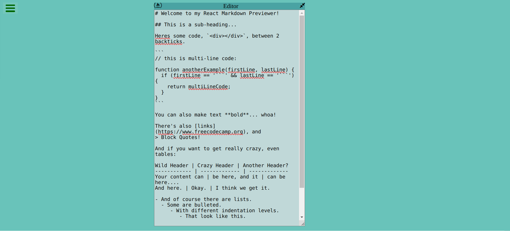
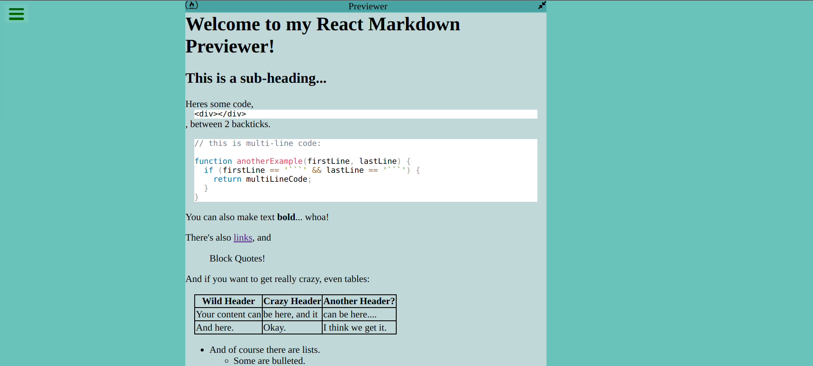

# Markdown Previewer

This project is a Markdown Previewer built with React. It allows users to input Markdown text and see a preview of the rendered HTML. This can be particularly useful for writing and previewing Markdown documents in real-time.

## Features

- Live Markdown editing and preview
- Supports GitHub flavored Markdown
- Syntax highlighting for code
- Easy to use interface

## Getting Started

To get a local copy up and running follow these simple example steps.

### Installation

1. Clone the repo
   git clone https://your-repository-link-here.git
2. Just start index.html

### Usage

Enter your Markdown content into the editor pane on the left, and see the HTML preview on the right.

## Screenshots

## License

Distributed under the MIT License. See `LICENSE` for more information.

## Contact

Nimesh Thakur - nimeshthakur0@gmail.com
